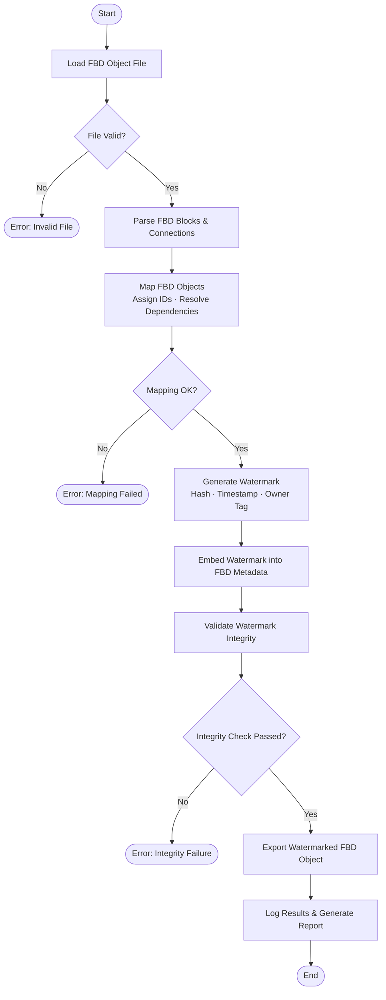

# ASE Mapping and Watermark of FBD Objects

Automated pipeline for **mapping** and **watermarking** Function Block Diagram (FBD) objects
as part of an Application Security Engineering (ASE) workflow.

---

## Flowchart



---

## Step-by-Step Execution

| Step | Module | Description |
|------|--------|-------------|
| 1 | `fbd_mapper.py` | Load and parse the FBD object file |
| 2 | `fbd_mapper.py` | Map all functional blocks, assign unique IDs, and resolve inter-block dependencies |
| 3 | `watermark.py`  | Generate a cryptographic watermark (SHA-256 hash + owner metadata + timestamp) |
| 4 | `watermark.py`  | Embed the watermark into the FBD object's metadata layer |
| 5 | `watermark.py`  | Verify watermark integrity after embedding |
| 6 | `pipeline.py`   | Orchestrate steps 1–5, capture results, write report |

---

## Project Structure

```
.
├── src/
│   ├── fbd_mapper.py   # FBD object loading, parsing, and mapping
│   ├── watermark.py    # Watermark generation, embedding, and verification
│   └── pipeline.py     # Step-by-step orchestration engine (entry point)
├── tests/
│   └── test_pipeline.py
├── .github/
│   └── workflows/
│       └── automate.yml  # CI/CD automation workflow
├── requirements.txt
└── README.md
```

---

## Quick Start

```bash
pip install -r requirements.txt
python src/pipeline.py --input path/to/fbd_object.json --owner "YourName"
```

---

## GitHub Actions Automation

The `.github/workflows/automate.yml` workflow:
- Triggers on every **push** and **pull request** to `main`
- Installs dependencies
- Runs the full pipeline against sample data
- Executes the test suite
- Uploads the generated report as an artifact
